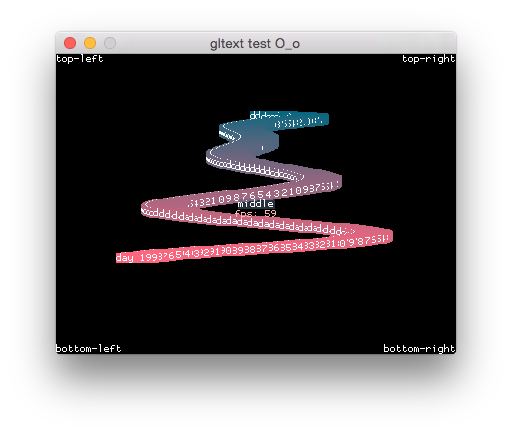

libgltext
=========

A very simple c++ opengl text rendering library with python wrappers. Too simple even for a makefile. There's also a pure python implementation under ``pywrappers/gltext_pyopenglversion/``.




Using
-----

There's no ``python setup.py install`` support. Just copy the ``pywrappers/gltext/`` directory with prebuilt libraries where it's needed and it'll work on windows/macosx/linux. OR if you're happy to sacrifice some speed, then copy the one-python-file version ``pywrappers/gltext_pyopenglversion/gltext.py``.

For usage example look into ``pywrappers/example.py``. Users of c++ are surely hardcore enough not to require any additional help (evil laugh).

```python
import gltext

tx = gltext.GLText("../data/font_proggy_opti_small.txt")
# init your opengl window here. important to do it before tx.init()
tx.init()

# draw white text on half-transparent black background
tx.drawbr("anchored from bottom-right", 100, 100, fgcolor=(1.,1.,1.,1.), bgcolor=(0.,0.,0.,0.5), z=1000.)
tx.drawtl("anchored from top-left", 100, 100)
tx.drawtl("below previous line", 100, 100 + tx.height)
```

The whole API:

```python
# variables about current font (read-only)

self.height    = 0
self.ascender  = 0
self.descender = 0

# variables about current state

self.z       = False
self.fgcolor = (1.0, 1.0, 1.0, 1.0)
self.bgcolor = (1.0, 1.0, 1.0, 0.0)

# methods

# * fgcolor, bgcolor and z retain values from previous use.
# * if z is false then opengl depth-testing is turned off.
# * if the bgcolor is completely transparent (bgcolor[3] == 0),
#   then text background rendering is turned off.

def init(self):
def width(self, text): """ return string width in pixels """
# top
def drawtl(self, text, x, y, fgcolor=None, bgcolor=None, z=None):
def drawtr(self, text, x, y, fgcolor=None, bgcolor=None, z=None):
def drawtm(self, text, x, y, fgcolor=None, bgcolor=None, z=None):
# bottom
def drawbl(self, text, x, y, fgcolor=None, bgcolor=None, z=None):
def drawbr(self, text, x, y, fgcolor=None, bgcolor=None, z=None):
def drawbm(self, text, x, y, fgcolor=None, bgcolor=None, z=None):
# middle
def drawml(self, text, x, y, fgcolor=None, bgcolor=None, z=None):
def drawmr(self, text, x, y, fgcolor=None, bgcolor=None, z=None):
def drawmm(self, text, x, y, fgcolor=None, bgcolor=None, z=None):
# baseline
def drawbll(self, text, x, y, fgcolor=None, bgcolor=None, z=None):
def drawblr(self, text, x, y, fgcolor=None, bgcolor=None, z=None):
def drawblm(self, text, x, y, fgcolor=None, bgcolor=None, z=None):
```


Building python wrappers
------------------------

Should not be necessary as because ``pywrappers/gltext/`` should already contain compiled wrappers for windows/linux/macosx.

    pip install cython

    cd pywrapper
    python setup.py build

And now copy the built shared library wherever it's needed.


### Windows 8.1

Tested with Visual C++ 2012 Express, Python 2.7.3 64 bit

    run cmd.exe
    set VS90COMNTOOLS=%VS110COMNTOOLS%
    call "C:\devtools\Microsoft Visual Studio 11.0\VC\vcvarsall.bat" x86_amd64
    python setup.py build


### Mac OS X

Yosemite works without problems.

Mountain Lion - to prevent errors like this:

    /usr/libexec/gcc/powerpc-apple-darwin10/4.0.1/as: assembler (/usr/bin/../libexec/gcc/darwin/ppc/as or /usr/bin/../local/libexec/gcc/darwin/ppc/as) for architecture ppc not installed
    Installed assemblers are:
    /usr/bin/../libexec/gcc/darwin/x86_64/as for architecture x86_64
    /usr/bin/../libexec/gcc/darwin/i386/as for architecture i386

disable ppc support:

    export ARCHFLAGS="-arch i386 -arch x86_64"; python setup.py build


Third-party libraries
---------------------

Uses [stb_image](http://nothings.org) for image loading.  
Uses the [Fluid Studios](http://www.paulnettle.com/) FontGen tool to generate font textures (``tools/Fluid_Studios_Font_Generation_Tool.zip``).


---

Random notes

`python setup.py build > log.txt 2>&1`  
`python setup.py build -c mingw32 > log.txt 2>&1`

